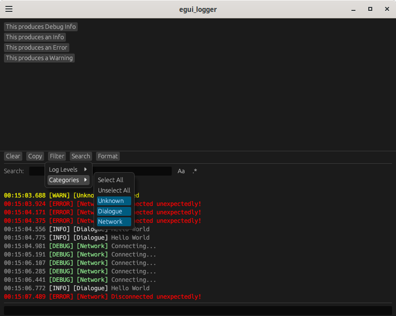

# egui_logger

This library implements a UI for displaying log messages in [`egui`](https://crates.io/crates/egui) applications.
There are also various ways to filter the logging output within the UI, such as a regex search through the messages.

This was forked from https://github.com/RegenJacob/egui_logger but has diverged
significantly. Instead of working with the [`log`](https://crates.io/crates/log)
crate, it has its own log methods.

It is intended to be used as a chat box in a game.

## Demo

## Features

* Search box (with toggles for regex and case sensitivity).
* Log messages can be tagged with a category. Anything that has ToString can be used, but it's recommended to provide your own LogCategory enum. Filtering on category is supported.
* Log messages have a severity level (Debug,Warn,Info,Error), and can be filtered to only that level and higher.
* Copy button that copies all logs to clipboard. It supports the current filter and search.
* Limits the number of messages and size of each message to avoid unbounded memory usage. Limits are configurable.

## TODO

* Ensure the UI renders smoothly for large logs and quick scrolling.
* Consider adding support for user input rather than making people roll their own.
* Go through TODOs in lib.rs